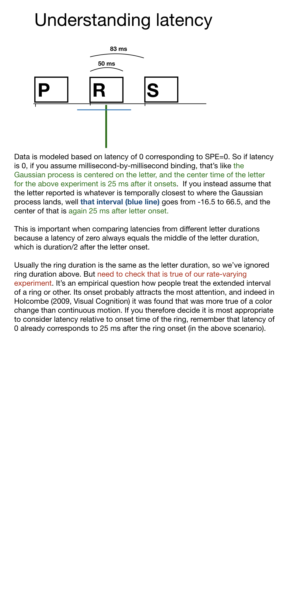

```{r, include = FALSE}
knitr::opts_chunk$set(
  collapse = TRUE,
  comment = "#>"
)
```

```{r setup, echo=FALSE}
library(mixRSVP)
```

Schematic to help understand what a latency of e.g. 0 really means.
```{r basic, echo=FALSE, fig.cap="", out.width = '100%'}

```

Some aspects likely can only be understood by considering different durations and ISIs. The duty cycle actually matters for interpretation of latency, see below:

```{r ratesPositivelyskewed, echo=FALSE, fig.cap="With positively skewed distributions", out.width = '100%'}
knitr::include_graphics("understandingLatencySkewedLudowici.png")
```

```{r ratesGaussian, echo=FALSE, fig.cap="With Gaussian distributions", out.width = '100%'}
knitr::include_graphics("understandingLatencyGaussianLudowici.png")
```

